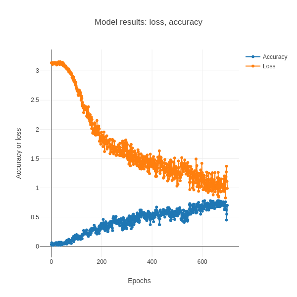

#  text_classification 

This repository contains code demonstrations of how to perform text classification for the following topics: 

  0. Text character classification
  1. Text classification using frequency count matrix with a Neural Network
  2. Text classification using BERT encoder model

## 0. Text character classification
The purpose of this repository is to demonstrate/compare character prediction of the alphabet (ABCDEFGHIJKLMNOPQRSTUVWXYZ) and/or text using different model definitions of the LSTM model. For example regarding the alphabet, given the character A, the model should predict B. The goal is to compare accuracy of different model definitions, to understand which model definitions are better than others for this simplistic alphabet data and for text. 

[Current working version] https://codesolutions2.github.io/text_classification/text_character_classification_index.html 

Below is a figure of the results for the best performing model (3 layer LSTM - 1 Dense layer), that acheived accuracy of 0.78, for simplistic alphabet data.

## 1. Text classification using frequency count matrix with a Neural Network
In progress

## 2. Text classification using BERT encoder model
In progress
